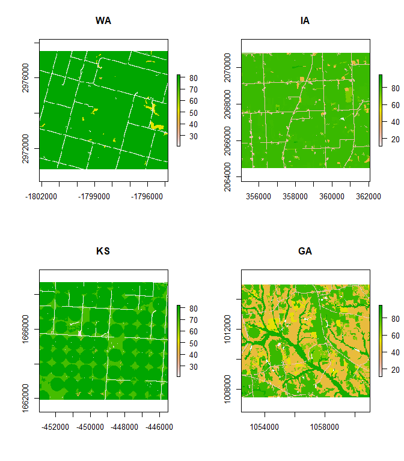

Biodiversity Metrics in Ag Landscapes
================

## Import National Landcover Data (NLCD)

``` r
library(tidyverse)
library(landscapemetrics) # landscape metrics calculation
library(raster)           # spatial raster data reading and handling
library(knitr)            # markdown tables

wash <- raster("data/landcover_wa.tiff") 
iowa <- raster("data/landcover_ia.tiff") 
georgia <- raster("data/landcover_ga.tiff") 
kansas <- raster("data/landcover_ks.tiff")
```

Let’s look at the four farms in this example.

<details>
<summary>Code</summary>

``` r
par(mfrow = c(2,2))
plot(wash)
title("WA")
plot(iowa)
title("IA")
plot(kansas)
title("KS")
plot(georgia)
title("GA")
```

</details>



## Shannon’s diversity index

It is a widely used metric in biodiversity and ecology and takes both
the number of classes and the abundance of each class into account.

$$SHDI = − \sum_{i = 1}^m ​P_i​ \times\ \ln(P_i​)$$

where $P_i$ is the proportion of class $i$, and $m$ is the number of
classes.

``` r
map(c(wash, kansas, georgia, iowa), lsm_l_shdi) |> 
  list_rbind() |> 
  mutate(farm = c("wash", "kansas", "georgia", "iowa")) |> 
  kable(digits = 2)
```

| layer | level     | class |  id | metric | value | farm    |
|------:|:----------|------:|----:|:-------|------:|:--------|
|     1 | landscape |    NA |  NA | shdi   |  0.28 | wash    |
|     1 | landscape |    NA |  NA | shdi   |  0.76 | kansas  |
|     1 | landscape |    NA |  NA | shdi   |  1.91 | georgia |
|     1 | landscape |    NA |  NA | shdi   |  0.88 | iowa    |

Table 1 Shannon’s diversity index

## Shannon’s evenness index

SHEI is a ‘Diversity metric’. It is the ratio between the actual
Shannon’s diversity index and and the theoretical maximum of the Shannon
diversity index. It can be understood as a measure of dominance.

$$SHEI = \frac{− \sum \limits_{i = 1}^m ​P_i​ \times\ \ln(P_i​)}{\ln(m)}$$

where $P_i$ is the proportion of class $i$, and $m$ is the number of
classes.

``` r
map(c(wash, kansas, georgia, iowa), lsm_l_shei) |> 
  list_rbind() |> 
  mutate(farm = c("wash", "kansas", "georgia", "iowa")) |> 
  kable(digits = 2)
```

| layer | level     | class |  id | metric | value | farm    |
|------:|:----------|------:|----:|:-------|------:|:--------|
|     1 | landscape |    NA |  NA | shei   |  0.14 | wash    |
|     1 | landscape |    NA |  NA | shei   |  0.34 | kansas  |
|     1 | landscape |    NA |  NA | shei   |  0.70 | georgia |
|     1 | landscape |    NA |  NA | shei   |  0.34 | iowa    |

Table 2 Shannon’s evenness index

## Simpson’s diversity index

SIDI is a ‘Diversity metric’. It is widely used in biodiversity and
ecology. It is less sensitive to rare class types than Shannon’s
diversity index. It can be interpreted as the probability that two
randomly selected cells belong to the same class.

$$SIDI = 1 − \sum_{i = 1}^m ​P_i^2$$

``` r
map(c(wash, kansas, georgia, iowa), lsm_l_sidi) |> 
  list_rbind() |> 
  mutate(farm = c("wash", "kansas", "georgia", "iowa")) |> 
  kable(digits = 2)
```

| layer | level     | class |  id | metric | value | farm    |
|------:|:----------|------:|----:|:-------|------:|:--------|
|     1 | landscape |    NA |  NA | sidi   |  0.11 | wash    |
|     1 | landscape |    NA |  NA | sidi   |  0.40 | kansas  |
|     1 | landscape |    NA |  NA | sidi   |  0.80 | georgia |
|     1 | landscape |    NA |  NA | sidi   |  0.40 | iowa    |

Table 3 Simpson’s diversity index

### References

Hesselbarth, M.H.K., Sciaini, M., With, K.A., Wiegand, K., Nowosad, J.
2019. landscapemetrics: an open-source R tool to calculate landscape
metrics. Ecography 42:1648-1657(ver. 0).

McGarigal, K., SA Cushman, and E Ene. 2012. FRAGSTATS v4: Spatial
Pattern Analysis Program for Categorical and Continuous Maps. Computer
software program produced by the authors at the University of
Massachusetts, Amherst. Available at the following web site:
https://www.umass.edu/landeco/

Shannon, C., and W. Weaver. 1949. The mathematical theory of
communication. Univ. IllinoisPress, Urbana

Simpson, E. H. 1949. Measurement of diversity. Nature 163:688

## Other things to explore

- [this
  link](https://smalltownbigdata.github.io/feb2021-landcover/feb2021-landcover.html)
- [this
  link](https://gatesdupontvignettes.com/2019/06/16/nlcd-velox-dplyr.html)
- and [this
  link](https://jakubnowosad.com/posts/2022-02-17-lsm-bp3/#reading-the-data)
