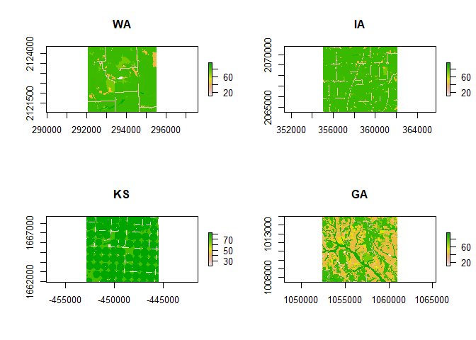

NLCD
================

``` r
library(tidyverse)
```

    ── Attaching packages ─────────────────────────────────────── tidyverse 1.3.2 ──
    ✔ ggplot2 3.4.0     ✔ purrr   1.0.1
    ✔ tibble  3.1.8     ✔ dplyr   1.1.0
    ✔ tidyr   1.3.0     ✔ stringr 1.5.0
    ✔ readr   2.1.3     ✔ forcats 1.0.0
    ── Conflicts ────────────────────────────────────────── tidyverse_conflicts() ──
    ✖ dplyr::filter() masks stats::filter()
    ✖ dplyr::lag()    masks stats::lag()

``` r
library(landscapemetrics)     # landscape metrics calculation
library(raster)               # spatial raster data reading and handling
```

    Loading required package: sp

    Attaching package: 'raster'

    The following object is masked from 'package:dplyr':

        select

``` r
library(sf)                   # spatial vector data reading and handling
```

    Linking to GEOS 3.9.3, GDAL 3.5.2, PROJ 8.2.1; sf_use_s2() is TRUE

``` r
library(tmap)                 # spatial viz
library(geofacet)             # geofacet

wash <- raster("data/landcover_wa.tiff") 
iowa <- raster("data/landcover_ia.tiff") 
georgia <- raster("data/landcover_ga.tiff") 
kansas <- raster("data/landcover_ks.tiff") 

par(mfrow = c(2,2))
plot(wash)
title("WA")
plot(iowa)
title("IA")
plot(kansas)
title("KS")
plot(georgia)
title("GA")
```



## Shannon’s diversity index (SDI)

It is a widely used metric in biodiversity and ecology and takes both
the number of classes and the abundance of each class into account.

$$SHDI = − \sum_{i = 1}^m ​P_i​ \times\ ln(P_i​)$$

where $P_i$ is the proportion of class $i$.

``` r
map(c(wash, kansas, georgia, iowa), lsm_l_shdi) |> 
  list_rbind() |> 
  mutate(farm = c("wash", "kansas", "georgia", "iowa"))
```

    # A tibble: 4 × 7
      layer level     class    id metric value farm   
      <int> <chr>     <int> <int> <chr>  <dbl> <chr>  
    1     1 landscape    NA    NA shdi   1.22  wash   
    2     1 landscape    NA    NA shdi   0.757 kansas 
    3     1 landscape    NA    NA shdi   1.91  georgia
    4     1 landscape    NA    NA shdi   0.880 iowa   

### References

Hesselbarth, M.H.K., Sciaini, M., With, K.A., Wiegand, K., Nowosad, J.
2019. landscapemetrics: an open-source R tool to calculate landscape
metrics. Ecography 42:1648-1657(ver. 0).

McGarigal, K., SA Cushman, and E Ene. 2012. FRAGSTATS v4: Spatial
Pattern Analysis Program for Categorical and Continuous Maps. Computer
software program produced by the authors at the University of
Massachusetts, Amherst. Available at the following web site:
https://www.umass.edu/landeco/

## Other things to explore

- [this
  link](https://smalltownbigdata.github.io/feb2021-landcover/feb2021-landcover.html)
- [this
  link](https://gatesdupontvignettes.com/2019/06/16/nlcd-velox-dplyr.html)
- and [this
  link](https://jakubnowosad.com/posts/2022-02-17-lsm-bp3/#reading-the-data)
